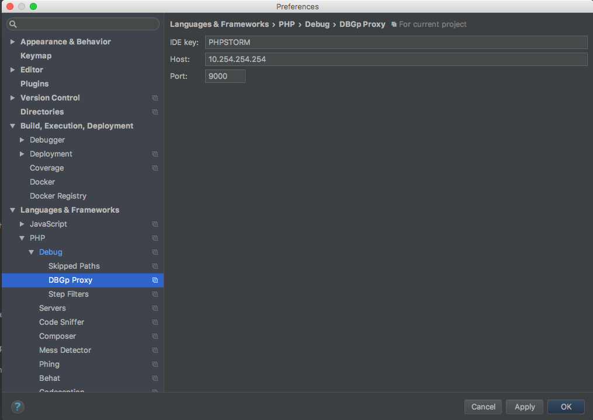
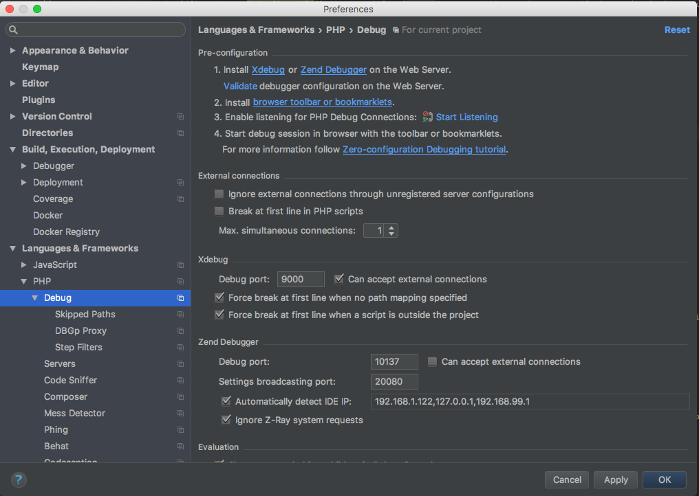
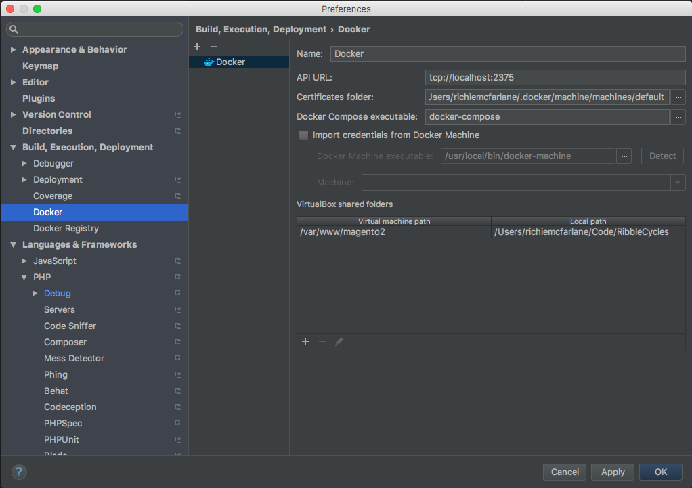
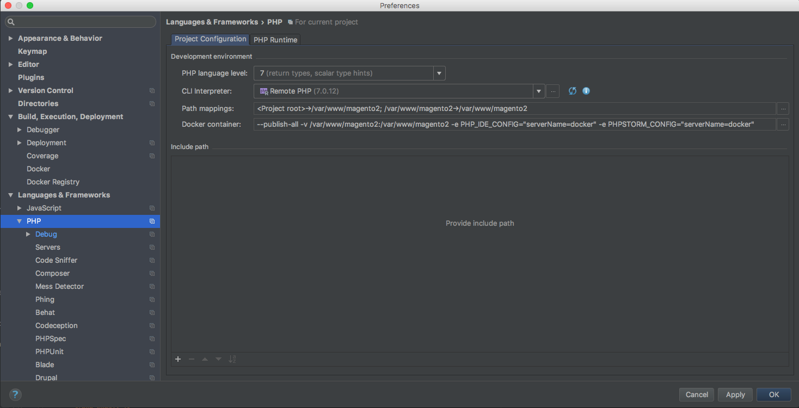

# Xdebug setup instructions

## Create host address alias
https://gist.github.com/ralphschindler/535dc5916ccbd06f53c1b0ee5a868c93

```
sudo curl -o /Library/LaunchDaemons/com.ralphschindler.docker_10254_alias.plist https://gist.githubusercontent.com/ralphschindler/535dc5916ccbd06f53c1b0ee5a868c93/raw/com.ralphschindler.docker_10254_alias.plist
```


## Docker set up in PHPStorm
http://jamescowie.me/blog/2016/12/all-hail-xdebug-and-lets-let-var-dump-die/

### PHPStorm DBGp Proxy setting


### PHPStorm Debug setting


### PHPStorm Docker setting


### PHPStorm PHP setting

